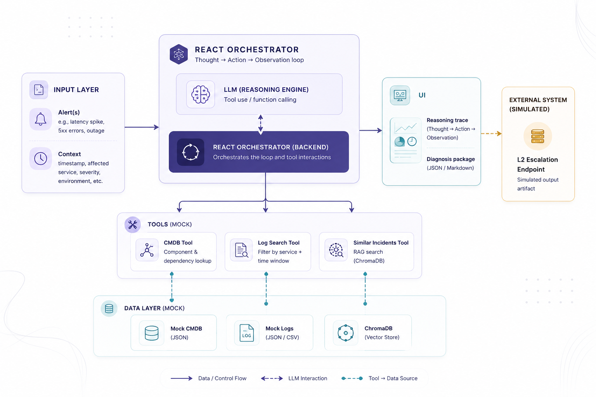
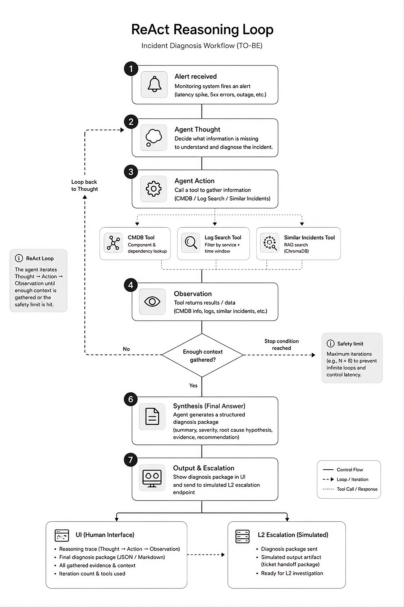

# Rootly — AI Diagnosis Orchestrator

## Project Overview

Rootly is a ReAct-style AI Diagnosis Orchestrator designed to automate the initial triage and preliminary diagnosis of IT incidents.

The system receives a simulated monitoring alert and investigates the incident by combining information from a mock CMDB, log search, and optionally a historical incident knowledge base. The AI agent follows a **Reason → Act → Observe** loop, correlates the retrieved information, and generates a structured diagnosis package for L2 escalation.

The MVP focuses on investigation and diagnosis only. It does not perform automated remediation or interact with real production systems.

## System Architecture

The proposed high-level architecture of the system is illustrated below.



## ReAct Reasoning Loop

The investigation process follows a ReAct-style **Thought → Action → Observation** loop, allowing the agent to iteratively gather information from the available tools before producing the final diagnosis.



---

# 1. Problem Definition & Scope

## 1.1 Business / IT Problem

In IT operations (NOC/SOC), when an incident occurs — increased latency on a service, a spike in 5xx errors, a crashing pod — the on-call engineer (L1) receives a raw alert from a monitoring tool and must manually:

* identify which component or service is affected;
* look up the CMDB (Configuration Management Database) to understand that service's dependencies;
* search the logs for relevant events within the incident's time window;
* correlate all of this information and write a summary for the L2 team, who own remediation.

This process is **manual, repetitive, and slow**. In many organizations, the on-call engineer spends 15–30 minutes just gathering context before they can escalate correctly — time during which the incident's business impact keeps growing, increasing MTTR.

## 1.2 Objective

Build a **ReAct-style AI agent (Reason + Act)** that automates the **triage and preliminary diagnosis** step.

The agent receives an alert, reasons about what information is missing, calls tools such as CMDB lookup and log search, optionally retrieves similar historical incidents, correlates the results, and produces a **structured diagnosis package** containing:

* estimated severity;
* affected components;
* at-risk dependencies;
* relevant log evidence;
* root-cause hypothesis;
* escalation recommendation.

The package is designed to be ready for handoff to L2.

## 1.3 Scope (In-Scope)

* A simulated alert-intake flow with mock alerts of different types: latency, errors, unavailability, and resource exhaustion.
* Mock tools for:

  * **CMDB** — component and dependency lookup;
  * **Log Search** — filtering by service and time window;
  * **Historical Incident Search** *(optional)* — RAG over similar past incidents.
* A ReAct agent that plans investigation steps, calls the appropriate tools, interprets the results, and decides when enough context has been gathered.
* Generation of a structured diagnosis package in JSON and/or Markdown containing:

  * summary;
  * affected component(s);
  * critical dependencies;
  * log-based evidence;
  * root-cause hypothesis;
  * severity/urgency level;
  * escalation recommendation.
* A minimal interface (web UI or CLI) to trigger a scenario and inspect:

  * the agent's reasoning trace;
  * the Thought → Action → Observation steps;
  * the final diagnosis package.
* A small set of KPIs for future evaluation of the solution against the current manual process.

## 1.4 Exclusions (Out of Scope for the MVP)

* **Automated remediation** — the agent decides what to investigate and what to conclude, but never takes autonomous action on a production system such as restarting a service, rolling back a deployment, or resizing a resource. Remediation remains an L2 decision.
* **Integration with real systems** such as Datadog, ServiceNow, Splunk, etc. Everything is mocked/simulated at this stage.
* **Actual escalation** — no real notifications or ticket creation. Escalation is represented as an output artifact.
* **Multi-tenant support, role-based permissions, or concurrent incident queues.**
* **Training a custom model** — the agent orchestrates an existing LLM via API rather than training one from scratch.

## 1.5 Assumptions

* Alert, CMDB, and log data are mocked but structured realistically.
* One incident is processed per agent run in the MVP.
* The LLM used supports tool use / function calling.
* L2 is a simulated recipient. The diagnosis package represents the system's final output.

---

# 2. Understanding of the Process (AS-IS)

## 2.1 The Traditional (Non-AI) Workflow

1. **Detection** — a monitoring system fires an alert, for example: "Service X — error rate > 5% over the last 5 minutes."
2. **Pickup** — the on-call L1 engineer receives the notification through Slack, PagerDuty, email, or another monitoring channel.
3. **Manual investigation**:

   * opens the monitoring dashboard to inspect the relevant metric;
   * checks the CMDB or internal documentation to understand the affected service and its dependencies;
   * opens a log tool such as Kibana or Splunk and manually creates queries;
   * attempts to correlate the information and identify a likely cause.
4. **Documentation** — writes a manual summary and opens a ticket for L2.
5. **Escalation** — L2 receives the ticket but may have to repeat part of the investigation because the available context is incomplete.

## 2.2 Bottlenecks (Pain Points)

* **Time loss** — manually correlating CMDB and log data takes minutes to tens of minutes.
* **Inconsistency** — diagnosis quality depends heavily on the engineer's experience.
* **Fragmented context** — relevant information is scattered across multiple tools.
* **Underused CMDB** — dependency information may not be consulted under time pressure.
* **No organizational memory** — similar historical incidents are difficult to retrieve and reuse systematically.
* **Incomplete tickets reaching L2** — L2 may need to request additional information or repeat the investigation.

## 2.3 What AI Can Improve

* Automate the investigative reasoning — deciding what to check, where, and in what order.
* Query CMDB and logs sequentially or in combination.
* Standardize the diagnosis package.
* Use RAG over historical incidents to surface potentially relevant previous cases.
* Reduce the time between alert intake and escalation with sufficient context.

---

# 3. Proposed Solution / TO-BE Flow

## 3.1 Vision

A **Diagnosis Orchestrator** receives a simulated alert and, through a ReAct reasoning loop, automatically investigates the incident using mock tools and produces a structured **diagnosis package** ready for L2 escalation.

## 3.2 TO-BE Flow (Step by Step)

1. **Input** — a simulated alert enters the system containing information such as the affected service, alert type, timestamp, and reported severity.
2. **Reason (Thought)** — the agent analyzes the alert and determines what information is missing.
3. **Act (Tool Call)** — the agent invokes the relevant tool:

   * `cmdb_lookup(component)` → returns metadata and dependencies;
   * `log_search(service, time_window, level)` → returns relevant mock log events;
   * `similar_incidents_search(query)` → optionally searches historical incidents.
4. **Observation** — the agent receives the tool's result and integrates it into its reasoning.
5. **Reason → Act → Observe Loop** — the agent repeats the process until it determines that sufficient context has been gathered or a maximum step count has been reached.
6. **Synthesis** — the agent assembles the diagnosis package:

   * incident summary;
   * affected component/service;
   * estimated severity;
   * critical dependencies;
   * concrete log evidence;
   * root-cause hypothesis;
   * confidence level;
   * escalation recommendation.
7. **Output** — the package is displayed in the UI and/or exported as JSON/Markdown together with the reasoning trace.

## 3.3 Key Differences vs. AS-IS

| AS-IS (Manual)                                    | TO-BE (Agent-Driven)                                |
| ------------------------------------------------- | --------------------------------------------------- |
| Manual investigation across multiple tools        | A single orchestrator calls the tools automatically |
| Free-form and inconsistent ticket write-ups       | Standardized diagnosis package                      |
| Investigation takes minutes to tens of minutes    | Automated investigation in seconds                  |
| Quality depends on individual engineer experience | Consistent reasoning and structured output          |
| Incident history rarely consulted                 | RAG can systematically search similar incidents     |

---

# 4. High-Level Architecture

## 4.1 Components and Relationships

* **Input Layer** — an alert simulator generating mock scenarios containing `service`, `alert_type`, `severity`, and `timestamp`.
* **Application / Backend (Orchestrator)** — the ReAct core that receives the alert, drives the Thought → Action → Observation loop, keeps a step history, and determines when to stop.
* **Model / LLM** — performs reasoning, chooses tools, interprets results, and drafts the final diagnosis package.
* **CMDB Tool** — a mock database containing components and their relationships.
* **Log Search Tool** — a mock log dataset filterable by service, time window, and severity level.
* **Similar Incidents Tool** *(optional, RAG)* — semantic search over a small corpus of historical incidents.
* **Data Layer** — mock datasets containing alerts, CMDB data, logs, and optionally historical incidents/vector data.
* **UI** — a simple web or CLI interface for triggering scenarios and viewing the ReAct trace and final diagnosis.
* **External Systems (simulated)** — an L2 escalation endpoint represented by an exported or displayed diagnosis package.
* **Output** — structured diagnosis data in JSON and/or human-readable Markdown/UI format.

## 4.2 Workflow Sketch

The system follows this conceptual workflow:

```text
Alert
  ↓
Orchestrator
  ↓
LLM — Thought
  ↓
Tool Selection
  ↓
Mock Tool
  ↓
Observation
  ↓
LLM — Reasoning
  ↓
Repeat until sufficient context
  ↓
Final Diagnosis Package
  ↓
UI / JSON / Markdown
```

## 4.3 Data Flow (Simplified)

```text
Alert
  ↓
Orchestrator
  ↓
LLM (Thought)
  ↓
Tool Selection
  ↓
Tool executes against mock data
  ↓
Observation
  ↓
LLM interprets result
  ↓
Reason → Act → Observe loop
  ↓
LLM synthesizes diagnosis
  ↓
UI / Export
```

---

# 5. Data Design & RAG Thinking

## 5.1 Required Data

1. **Alerts (input)** — mock alert scenarios.
2. **CMDB** — IT components and their relationships.
3. **Logs** — per-service events with timestamps and severity levels.
4. **Incident history** *(optional, for RAG)* — previously resolved incidents.

## 5.2 Approximate Schema (Entities)

### Alert

```json
{
  "id": "ALRT-001",
  "service": "checkout-api",
  "alert_type": "error_rate_high",
  "severity_reported": "high",
  "timestamp": "2026-08-18T09:12:00Z",
  "metric_value": 7.4
}
```

### CMDB Component

```json
{
  "id": "CI-014",
  "name": "checkout-api",
  "type": "microservice",
  "owner_team": "payments-team",
  "depends_on": [
    "CI-021 (payments-db)",
    "CI-030 (auth-service)"
  ],
  "depended_by": [
    "CI-050 (web-frontend)"
  ]
}
```

### Log Entry

```json
{
  "timestamp": "2026-08-18T09:10:32Z",
  "service": "checkout-api",
  "level": "ERROR",
  "message": "Connection timeout to payments-db",
  "trace_id": "abc123"
}
```

### Historical Incident (for RAG)

```json
{
  "id": "INC-2025-114",
  "description": "checkout-api errors caused by payments-db connection pool exhaustion",
  "root_cause": "DB connection pool misconfigured after a scale-up event",
  "resolution": "Increased pool size and added a circuit breaker",
  "tags": [
    "checkout-api",
    "payments-db",
    "timeout"
  ]
}
```

## 5.3 Mock Data Strategy

* Generate static JSON/CSV mock files.
* Use roughly 5–10 CMDB components with realistic dependency relationships.
* Use 50–100 log entries distributed across several services.
* Create 2–3 distinct alert scenarios with different underlying root causes.
* Create 5–10 historical incidents for the RAG corpus.
* Design the scenarios so that correlating CMDB and log data leads to a plausible conclusion.

## 5.4 What Needs Retrieval / Search

* **CMDB lookup** — structured lookup and dependency-graph traversal.
* **Log search** — structured filtering by service, time window, severity, and optionally message content.
* **Incident history** — semantic retrieval is useful because similar incidents may use different wording.

## 5.5 Possible ChromaDB Usage

ChromaDB can optionally be used for the historical incident search component.

Historical incidents can be embedded using their descriptions and tags. For a new incident, the system can construct a query from the alert and retrieved context, search for the most similar historical incidents, and provide the results to the LLM as additional context for its root-cause hypothesis.

For the MVP, CMDB and log data can remain structured lookups. A vector store is specifically reserved for the optional similar-incidents retrieval component.

---

# 6. Reasoning / Decision / Execution Concept

At the MVP stage, the system can be implemented as **a single ReAct-style orchestrator agent** with access to multiple tools.

The agent follows:

```text
Thought
   ↓
Action
   ↓
Observation
   ↓
Thought
   ↓
...
   ↓
Final Diagnosis
```

The decision to continue investigating or stop is made using predefined stopping criteria, such as:

* the primary component has been checked;
* at least one relevant dependency has been investigated;
* relevant log evidence has been found;
* the maximum investigation step count has not been exceeded.

Tool execution itself remains deterministic. The tools retrieve and return data; the LLM is responsible for interpretation and reasoning.

In future iterations, the single orchestrator could evolve into a multi-agent architecture with specialized agents for CMDB analysis, log analysis, and diagnosis synthesis.

---

# 7. KPIs & Success Criteria

## 7.1 Time-to-Diagnosis

The time elapsed from alert intake until the generation of a complete diagnosis package.

**Measurement method:**

```text
Alert intake
     ↓
Agent investigation
     ↓
Final diagnosis generated
     ↓
Time-to-Diagnosis
```

The measured value can later be compared with the estimated time required for the equivalent manual investigation.

## 7.2 Diagnosis Quality / Correctness Rate

For each mock scenario, evaluate whether the generated diagnosis correctly identifies:

1. the affected component;
2. at least the relevant critical dependency;
3. a root-cause hypothesis consistent with the available log evidence.

A manual evaluation checklist can be applied to a fixed set of test scenarios to calculate an overall correctness percentage.

---

# 8. MVP Status

> **Current status:** Documentation and system design phase.

The repository currently contains the project documentation and architecture design. Implementation of the orchestrator, mock tools, datasets, and interface will be added incrementally.

---

# 9. Future Development

Planned extensions may include:

* implementation of the ReAct orchestrator;
* mock CMDB and dependency graph;
* mock log search;
* historical incident retrieval using RAG;
* ChromaDB integration;
* web-based investigation interface;
* diagnosis package export;
* automated KPI collection;
* multi-agent architecture;
* integration with real observability and ticketing systems in a future version.

---

# 10. Project Structure

The project structure will evolve as implementation progresses. The documentation diagrams are currently stored under `docs/diagrams/`.

```text
Rootly/
├── README.md
└── docs/
    └── diagrams/
        ├── architecture.png
        └── react-reasoning-loop.png
```

As implementation progresses, additional directories for source code, mock data, tools, and tests will be added.
