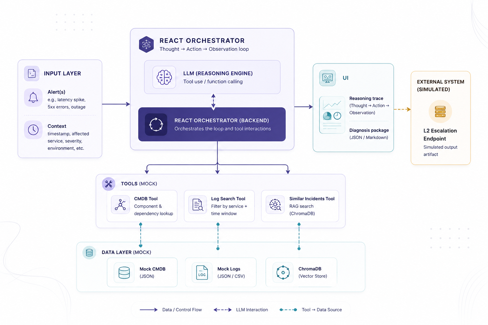
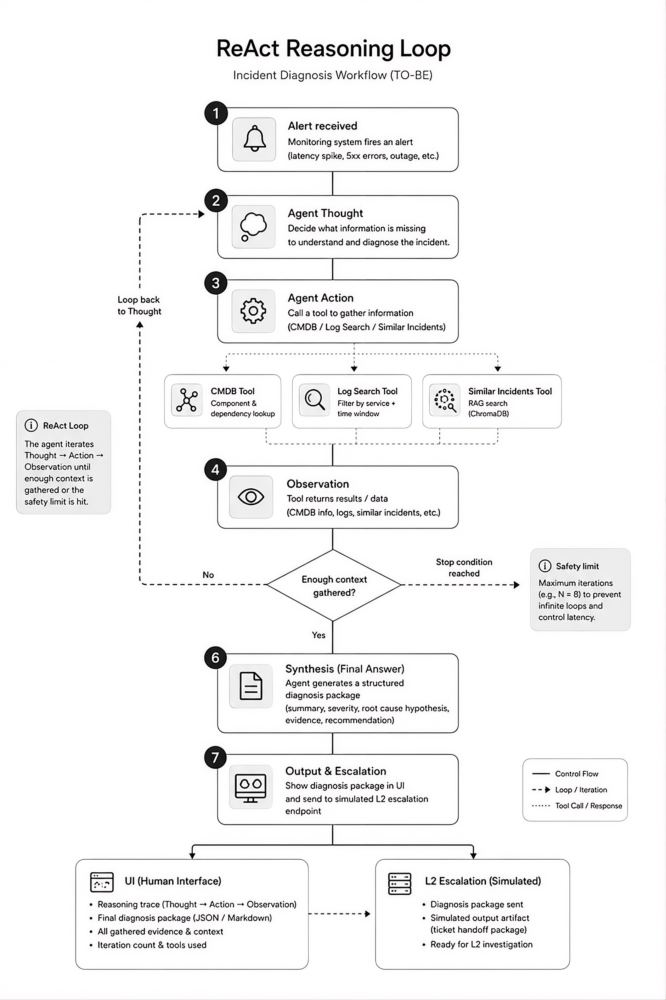
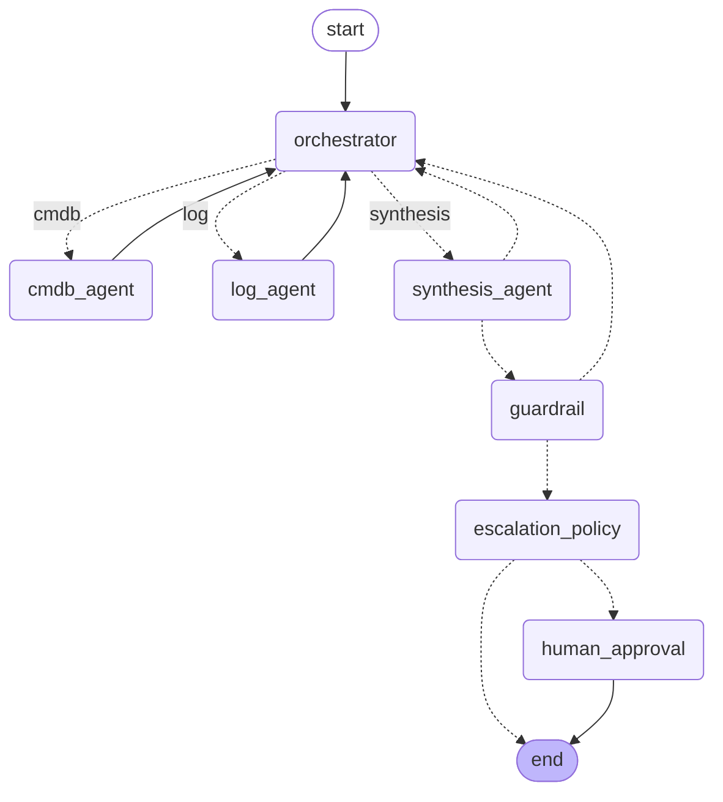

# Rootly — AI Diagnosis Orchestrator

## Project Overview

Rootly is a ReAct-style AI Diagnosis Orchestrator designed to automate the initial triage and preliminary diagnosis of IT incidents.

The system receives a simulated monitoring alert and investigates the incident by combining information from a mock CMDB, log search, and optionally a historical incident knowledge base. The AI agent follows a **Reason → Act → Observe** loop, correlates the retrieved information, and generates a structured diagnosis package for L2 escalation.

The MVP focuses on investigation and diagnosis only. It does not perform automated remediation or interact with real production systems.

## System Architecture

The proposed high-level architecture of the system is illustrated below.



## ReAct Reasoning Loop

The investigation process follows a ReAct-style **Thought → Action → Observation** loop, allowing the agent to iteratively gather information from the available tools before producing the final diagnosis.



---

# 1. Problem Definition & Scope

## 1.1 Business / IT Problem

In IT operations (NOC/SOC), when an incident occurs — increased latency on a service, a spike in 5xx errors, a crashing pod — the on-call engineer (L1) receives a raw alert from a monitoring tool and must manually:

* identify which component or service is affected;
* look up the CMDB (Configuration Management Database) to understand that service's dependencies;
* search the logs for relevant events within the incident's time window;
* correlate all of this information and write a summary for the L2 team, who own remediation.

This process is **manual, repetitive, and slow**. In many organizations, the on-call engineer spends 15–30 minutes just gathering context before they can escalate correctly — time during which the incident's business impact keeps growing, increasing MTTR.

## 1.2 Objective

Build a **ReAct-style AI agent (Reason + Act)** that automates the **triage and preliminary diagnosis** step.

The agent receives an alert, reasons about what information is missing, calls tools such as CMDB lookup and log search, optionally retrieves similar historical incidents, correlates the results, and produces a **structured diagnosis package** containing:

* estimated severity;
* affected components;
* at-risk dependencies;
* relevant log evidence;
* root-cause hypothesis;
* escalation recommendation.

The package is designed to be ready for handoff to L2.

## 1.3 Scope (In-Scope)

* A simulated alert-intake flow with mock alerts of different types: latency, errors, unavailability, and resource exhaustion.
* Mock tools for:

  * **CMDB** — component and dependency lookup;
  * **Log Search** — filtering by service and time window;
  * **Historical Incident Search** *(optional)* — RAG over similar past incidents.
* A team of ReAct agents — an orchestrator that plans the investigation and three specialists (CMDB, logs, synthesis) that each own one part of the toolset, interpret their own results, and hand findings back until enough context has been gathered.
* Generation of a structured diagnosis package in JSON and/or Markdown containing:

  * summary;
  * affected component(s);
  * critical dependencies;
  * log-based evidence;
  * root-cause hypothesis;
  * severity/urgency level;
  * escalation recommendation.
* A minimal interface (web UI or CLI) to trigger a scenario and inspect:

  * the agent's reasoning trace;
  * the Thought → Action → Observation steps;
  * the final diagnosis package.
* A small set of KPIs for future evaluation of the solution against the current manual process.

## 1.4 Exclusions (Out of Scope for the MVP)

* **Automated remediation** — the agent decides what to investigate and what to conclude, but never takes autonomous action on a production system such as restarting a service, rolling back a deployment, or resizing a resource. Remediation remains an L2 decision.
* **Integration with real systems** such as Datadog, ServiceNow, Splunk, etc. Everything is mocked/simulated at this stage.
* **Actual escalation** — no real notifications or ticket creation. Escalation is represented as an output artifact.
* **Multi-tenant support, role-based permissions, or concurrent incident queues.**
* **Training a custom model** — the agent orchestrates an existing LLM via API rather than training one from scratch.

## 1.5 Assumptions

* Alert, CMDB, and log data are mocked but structured realistically.
* One incident is processed per agent run in the MVP.
* The LLM used supports tool use / function calling.
* L2 is a simulated recipient. The diagnosis package represents the system's final output.

---

# 2. Understanding of the Process (AS-IS)

## 2.1 The Traditional (Non-AI) Workflow

1. **Detection** — a monitoring system fires an alert, for example: "Service X — error rate > 5% over the last 5 minutes."
2. **Pickup** — the on-call L1 engineer receives the notification through Slack, PagerDuty, email, or another monitoring channel.
3. **Manual investigation**:

   * opens the monitoring dashboard to inspect the relevant metric;
   * checks the CMDB or internal documentation to understand the affected service and its dependencies;
   * opens a log tool such as Kibana or Splunk and manually creates queries;
   * attempts to correlate the information and identify a likely cause.
4. **Documentation** — writes a manual summary and opens a ticket for L2.
5. **Escalation** — L2 receives the ticket but may have to repeat part of the investigation because the available context is incomplete.

## 2.2 Bottlenecks (Pain Points)

* **Time loss** — manually correlating CMDB and log data takes minutes to tens of minutes.
* **Inconsistency** — diagnosis quality depends heavily on the engineer's experience.
* **Fragmented context** — relevant information is scattered across multiple tools.
* **Underused CMDB** — dependency information may not be consulted under time pressure.
* **No organizational memory** — similar historical incidents are difficult to retrieve and reuse systematically.
* **Incomplete tickets reaching L2** — L2 may need to request additional information or repeat the investigation.

## 2.3 What AI Can Improve

* Automate the investigative reasoning — deciding what to check, where, and in what order.
* Query CMDB and logs sequentially or in combination.
* Standardize the diagnosis package.
* Use RAG over historical incidents to surface potentially relevant previous cases.
* Reduce the time between alert intake and escalation with sufficient context.

---

# 3. Proposed Solution / TO-BE Flow

## 3.1 Vision

A **Diagnosis Orchestrator** receives a simulated alert and, through a ReAct reasoning loop, automatically investigates the incident using mock tools and produces a structured **diagnosis package** ready for L2 escalation.

## 3.2 TO-BE Flow (Step by Step)

1. **Input** — a simulated alert enters the system containing information such as the affected service, alert type, timestamp, and reported severity.
2. **Reason (Thought)** — the agent analyzes the alert and determines what information is missing.
3. **Act (Tool Call)** — the agent invokes the relevant tool:

   * `cmdb_lookup(component)` → returns metadata and dependencies;
   * `log_search(service, time_window, level)` → returns relevant mock log events;
   * `similar_incidents_search(query)` → optionally searches historical incidents.
4. **Observation** — the agent receives the tool's result and integrates it into its reasoning.
5. **Reason → Act → Observe Loop** — the agent repeats the process until it determines that sufficient context has been gathered or a maximum step count has been reached.
6. **Synthesis** — the agent assembles the diagnosis package:

   * incident summary;
   * affected component/service;
   * estimated severity;
   * critical dependencies;
   * concrete log evidence;
   * root-cause hypothesis;
   * confidence level;
   * escalation recommendation.
7. **Output** — the package is displayed in the UI and/or exported as JSON/Markdown together with the reasoning trace.

## 3.3 Key Differences vs. AS-IS

| AS-IS (Manual)                                    | TO-BE (Agent-Driven)                                |
| ------------------------------------------------- | --------------------------------------------------- |
| Manual investigation across multiple tools        | A single orchestrator calls the tools automatically |
| Free-form and inconsistent ticket write-ups       | Standardized diagnosis package                      |
| Investigation takes minutes to tens of minutes    | Automated investigation in seconds                  |
| Quality depends on individual engineer experience | Consistent reasoning and structured output          |
| Incident history rarely consulted                 | RAG can systematically search similar incidents     |

---

# 4. High-Level Architecture

## 4.1 Components and Relationships

* **Input Layer** — an alert simulator generating mock scenarios containing `service`, `alert_type`, `severity`, and `timestamp`.
* **Application / Backend (Orchestrator)** — the ReAct core that receives the alert, drives the Thought → Action → Observation loop, keeps a step history, and determines when to stop.
* **Model / LLM** — performs reasoning, chooses tools, interprets results, and drafts the final diagnosis package.
* **CMDB Tool** — a mock database containing components and their relationships.
* **Log Search Tool** — a mock log dataset filterable by service, time window, and severity level.
* **Similar Incidents Tool** *(optional, RAG)* — semantic search over a small corpus of historical incidents.
* **Data Layer** — mock datasets containing alerts, CMDB data, logs, and optionally historical incidents/vector data.
* **UI** — a simple web or CLI interface for triggering scenarios and viewing the ReAct trace and final diagnosis.
* **External Systems (simulated)** — an L2 escalation endpoint represented by an exported or displayed diagnosis package.
* **Output** — structured diagnosis data in JSON and/or human-readable Markdown/UI format.

## 4.2 Workflow Sketch

The system follows this conceptual workflow:

```text
Alert
  ↓
Orchestrator
  ↓
LLM — Thought
  ↓
Tool Selection
  ↓
Mock Tool
  ↓
Observation
  ↓
LLM — Reasoning
  ↓
Repeat until sufficient context
  ↓
Final Diagnosis Package
  ↓
UI / JSON / Markdown
```

## 4.3 Data Flow (Simplified)

```text
Alert
  ↓
Orchestrator
  ↓
LLM (Thought)
  ↓
Tool Selection
  ↓
Tool executes against mock data
  ↓
Observation
  ↓
LLM interprets result
  ↓
Reason → Act → Observe loop
  ↓
LLM synthesizes diagnosis
  ↓
UI / Export
```

---

# 5. Data Design & RAG Thinking

## 5.1 Required Data

1. **Alerts (input)** — mock alert scenarios.
2. **CMDB** — IT components and their relationships.
3. **Logs** — per-service events with timestamps and severity levels.
4. **Incident history** *(optional, for RAG)* — previously resolved incidents.

## 5.2 Approximate Schema (Entities)

### Alert

```json
{
  "id": "ALRT-001",
  "service": "checkout-api",
  "alert_type": "error_rate_high",
  "severity_reported": "high",
  "timestamp": "2026-08-18T09:12:00Z",
  "metric_value": 7.4
}
```

### CMDB Component

```json
{
  "id": "CI-014",
  "name": "checkout-api",
  "type": "microservice",
  "owner_team": "payments-team",
  "depends_on": [
    "CI-021 (payments-db)",
    "CI-030 (auth-service)"
  ],
  "depended_by": [
    "CI-050 (web-frontend)"
  ]
}
```

### Log Entry

```json
{
  "timestamp": "2026-08-18T09:10:32Z",
  "service": "checkout-api",
  "level": "ERROR",
  "message": "Connection timeout to payments-db",
  "trace_id": "abc123"
}
```

### Historical Incident (for RAG)

```json
{
  "id": "INC-2025-114",
  "description": "checkout-api errors caused by payments-db connection pool exhaustion",
  "root_cause": "DB connection pool misconfigured after a scale-up event",
  "resolution": "Increased pool size and added a circuit breaker",
  "tags": [
    "checkout-api",
    "payments-db",
    "timeout"
  ]
}
```

## 5.3 Mock Data Strategy

* Generate static JSON/CSV mock files.
* Use roughly 5–10 CMDB components with realistic dependency relationships.
* Use 50–100 log entries distributed across several services.
* Create 2–3 distinct alert scenarios with different underlying root causes.
* Create 5–10 historical incidents for the RAG corpus.
* Design the scenarios so that correlating CMDB and log data leads to a plausible conclusion.

## 5.4 What Needs Retrieval / Search

* **CMDB lookup** — structured lookup and dependency-graph traversal.
* **Log search** — structured filtering by service, time window, severity, and optionally message content.
* **Incident history** — semantic retrieval is useful because similar incidents may use different wording.

## 5.5 Possible ChromaDB Usage

ChromaDB can optionally be used for the historical incident search component.

Historical incidents can be embedded using their descriptions and tags. For a new incident, the system can construct a query from the alert and retrieved context, search for the most similar historical incidents, and provide the results to the LLM as additional context for its root-cause hypothesis.

For the MVP, CMDB and log data can remain structured lookups. A vector store is specifically reserved for the optional similar-incidents retrieval component.

---

# 6. Reasoning / Decision / Execution Concept

At the MVP stage, the system can be implemented as **a single ReAct-style orchestrator agent** with access to multiple tools.

The agent follows:

```text
Thought
   ↓
Action
   ↓
Observation
   ↓
Thought
   ↓
...
   ↓
Final Diagnosis
```

The decision to continue investigating or stop is made using predefined stopping criteria, such as:

* the primary component has been checked;
* at least one relevant dependency has been investigated;
* relevant log evidence has been found;
* the maximum investigation step count has not been exceeded.

Tool execution itself remains deterministic. The tools retrieve and return data; the LLM is responsible for interpretation and reasoning.

In future iterations, the single orchestrator could evolve into a multi-agent architecture with specialized agents for CMDB analysis, log analysis, and diagnosis synthesis.

---

# 7. KPIs & Success Criteria

## 7.1 Time-to-Diagnosis

The time elapsed from alert intake until the generation of a complete diagnosis package.

**Measurement method:**

```text
Alert intake
     ↓
Agent investigation
     ↓
Final diagnosis generated
     ↓
Time-to-Diagnosis
```

The measured value can later be compared with the estimated time required for the equivalent manual investigation.

## 7.2 Diagnosis Quality / Correctness Rate

For each mock scenario, evaluate whether the generated diagnosis correctly identifies:

1. the affected component;
2. at least the relevant critical dependency;
3. a root-cause hypothesis consistent with the available log evidence.

A manual evaluation checklist can be applied to a fixed set of test scenarios to calculate an overall correctness percentage.

---

# 8. MVP Status

> **Current status:** MVP implemented — tools, multi-agent diagnosis graph, CLI and Streamlit UI.

| Component | Implementation |
| --- | --- |
| Mock data | 10 alert scenarios, 11 CMDB components, 201 logs, 10 historical incidents (see [`docs/MOCK_DATA_README.md`](./docs/MOCK_DATA_README.md)) |
| Tools | `cmdb_lookup`, `log_search`, `similar_incidents_search` (RAG: ChromaDB + all-MiniLM-L6-v2, BM25 fallback) |
| Agents | Four agents in one LangGraph `StateGraph` on Mistral tool calling (`langchain-mistralai`): an **orchestrator** that only routes, plus **CMDB**, **log** and **synthesis** specialists, each holding exactly one part of the toolset. The diagnosis is submitted through a `submit_diagnosis` tool. See [Agents](#agents) below |
| Guardrail | The package may only reference CMDB components and historical incidents that exist, and every `log_evidence` line must match a real entry in the log corpus, attributed to the service that actually logged it. A component is only accepted as the origin once the logs of every upstream dependency that the component's own error logs blame have been searched. Unchanged by the multi-agent split: the synthesis agent's `submit_diagnosis` goes through exactly the same `check_package()` |
| Escalation | Deterministic policy after the guardrail (`src/agent/escalation_policy.py`): critical severity, a blast radius of ≥ 2 CMDB dependents, or confidence < 0.70 each force an urgent escalation that needs human approval; a confident low/medium diagnosis is auto-resolved; anything else is a normal escalation |
| Human-in-the-loop | Urgent escalations pause the graph with `interrupt()`; state is checkpointed to SQLite (`.checkpoints/`), so a human can approve or downgrade (“not urgent”) later, from the CLI or Streamlit, even from another process. The decision and optional note are recorded in the package |
| Interfaces | `run_cli.py` (Rich) and `src/ui/streamlit_app.py` |

### Agents

Rootly runs four agents over one shared state. The orchestrator holds no investigation
tools at all — it only decides who works next — and each specialist is bound to exactly
one part of the toolset, enforced at dispatch: a call to a tool outside an agent's role is
refused as an error observation instead of being executed.

| Agent | File | Tools | Produces |
| --- | --- | --- | --- |
| Orchestrator | `graph_nodes.orchestrator_node` | `route_to_specialist` only | `next_specialist` + the assignment (targets, time window, reason) |
| CMDB | `specialists/cmdb_agent.py` | `cmdb_lookup` | `cmdb_context`: dependency chain (`depends_on` = candidate causes), blast radius (`depended_by`), owner team, deploy/config clues |
| Log | `specialists/log_agent.py` | `log_search` | `log_evidence_gathered`: quoted log lines + a LOCAL / RELAY / HEALTHY verdict per service. The only agent that fills `investigated_services`, which the guardrail's origin and reachability checks are built on |
| Synthesis | `specialists/synthesis_agent.py` | `similar_incidents_search`, `submit_diagnosis` | the `DiagnosisPackage`, handed to the guardrail |

No agent receives the shared `messages` log. Each is briefed with its own system prompt
(`src/agent/system_prompt.py`), the alert, and the structured findings gathered so far, so
every context stays small and role-specific. `messages` remains the run's audit trail and
is what the guardrail reads the synthesis agent's `submit_diagnosis` call off.

### Diagnosis graph

Generated with `build_graph(...).get_graph().draw_mermaid()` (dashed edges are conditional):


```mermaid
graph TD;
	__start__([start]):::first
	orchestrator(orchestrator)
	cmdb_agent(cmdb_agent)
	log_agent(log_agent)
	synthesis_agent(synthesis_agent)
	guardrail(guardrail)
	escalation_policy(escalation_policy)
	human_approval(human_approval)
	__end__([end]):::last
	__start__ --> orchestrator;
	orchestrator -. cmdb .-> cmdb_agent;
	orchestrator -. log .-> log_agent;
	orchestrator -. synthesis .-> synthesis_agent;
	cmdb_agent --> orchestrator;
	log_agent --> orchestrator;
	synthesis_agent -.-> guardrail;
	synthesis_agent -.-> orchestrator;
	guardrail -.-> orchestrator;
	guardrail -.-> escalation_policy;
	escalation_policy -.-> __end__;
	escalation_policy -.-> human_approval;
	human_approval --> __end__;
	classDef default fill:#f2f0ff,line-height:1.2
	classDef first fill-opacity:0
	classDef last fill:#bfb6fc
```

* `orchestrator` — one model turn that must end in `route_to_specialist`. Control returns
  here after every specialist, so the investigation can keep walking upstream.
* `cmdb_agent` / `log_agent` — run their one tool, then report their analysis; each loops
  internally for at most `SPECIALIST_MAX_TURNS` (3) model turns.
* `synthesis_agent` — searches historical incidents, then calls `submit_diagnosis`. If it
  ends without a package, control goes back to the orchestrator.
* `guardrail` — a rejected package goes back to the **orchestrator**, not to the synthesis
  agent: the rejection reasons name the services whose logs are still missing, and only the
  log agent can close that gap. This is what makes the multi-hop scenarios reachable.
* `escalation_policy` → `human_approval` only for urgent escalations.

## Handoff-uri între agenți

Fiecare handoff are un contract de date explicit:

| Sursă → Destinație | Ce se transferă | Ce validează destinația |
|---|---|---|
| orchestrator → cmdb_agent | `assignment.targets` (nume de componente) | Fiecare `cmdb_lookup` e dispatch-uit prin `ToolRegistry`; o componentă inexistentă devine o observație de eroare |
| orchestrator → log_agent | `assignment.targets` + fereastra `start_time`/`end_time` | O fereastră lipsă e completată din timestamp-ul alertei (−30 min … +10 min); un handoff „log” fără niciun serviciu e respins ca argument invalid |
| orchestrator → synthesis_agent | Întreg `cmdb_context` + `log_evidence_gathered` | `affected_component` trebuie să fie componenta cu verdict LOCAL, nu una care doar relayează |
| orchestrator → orchestrator | Răspuns fără `route_to_specialist` | Reamintire, iar la a doua rata CMDB/log/synthesis determinist (recuperare din eroare, nu o a doua politică de routing) |
| specialist → orchestrator | Analiza proprie + datele brute, ca state structurat | Orchestratorul decide dacă mai e nevoie de un hop upstream |
| synthesis_agent → guardrail | `AIMessage` cu `submit_diagnosis` | Verificări CMDB + origin check + reachability tranzitiv + căutarea istorică |
| guardrail → orchestrator | `replan_reasons` (lista motivelor) | Pachet respins; orchestratorul trebuie să dispatch-uiască logurile cerute înainte de o nouă sinteză |
| guardrail → escalation_policy | `DiagnosisPackage` validat | Severitate critică / blast radius ≥ 2 / confidence < 0.70 |
| escalation_policy → human_approval | Decizie urgentă + `interrupt()` | Pauză checkpoint-ată în SQLite |
| human_approval → END | Decizia umană (`approve`/`downgrade`) | Stare reluată din checkpoint-ul SQLite |

### Rate limiting

Multi-agent means more model calls per scenario than the former single agent. Measured over
the 10 evaluation scenarios: **9 to 25 model turns** (median 12) against 4–8 for the single
agent — one turn per routing decision plus two per specialist run, and more every time the
guardrail sends the investigation back for another round. Two scenarios (ALRT-004, ALRT-010)
exhausted the 32-turn budget entirely; see `EVAL_RESULTS.md`. Mistral's free tier allows about 1 request/second; the backoff in
`graph_nodes._invoke()` (2s, 4s, 8s, 16s) absorbs the 429s, so a full `evaluate.py` run
simply takes longer — budget roughly 15 minutes for a single pass over the 10 scenarios,
and three times that for `--runs 3`. `MAX_REACT_STEPS` caps the total at `DEFAULT_MAX_STEPS` (32) model
turns per run.

## Quickstart (Docker)

```bash
cp .env.example .env   # apoi setează MISTRAL_API_KEY
docker compose up --build
```

| Serviciu | URL |
|---|---|
| Streamlit UI | http://localhost:8501 |
| FastAPI Swagger | http://localhost:8000/docs |
| Phoenix (trace-uri) | http://localhost:6006 |

Necesită Docker Compose >= 2.24 (pentru sintaxa `required: false` pe `env_file`).

## Observabilitate (Arize Phoenix)

Phoenix pornește automat cu `docker compose up`. Pentru dezvoltare fără Docker:

```bash
docker run -d -p 6006:6006 arizephoenix/phoenix:latest
```

Setează `PHOENIX_COLLECTOR_ENDPOINT=http://localhost:6006/v1/traces` în `.env`, apoi:

```bash
python run_cli.py ALRT-001                 # bash
```

```powershell
$env:PHOENIX_COLLECTOR_ENDPOINT="http://localhost:6006/v1/traces"; python run_cli.py ALRT-001
```

Deschide http://localhost:6006 pentru trace-uri. Fără `PHOENIX_COLLECTOR_ENDPOINT`
setat, tracing-ul e dezactivat și nimic nu se schimbă.

## Getting started

```bash
python -m venv .venv
.venv\Scripts\activate        # Windows — macOS/Linux: source .venv/bin/activate
pip install -r requirements.txt
cp .env.example .env          # then set MISTRAL_API_KEY
```

A free Mistral API key is available on the **Experiment** plan at [console.mistral.ai](https://console.mistral.ai) (phone verification required). `mistral-large-latest` and `mistral-small-latest` were unreliable on that plan in testing (403 tier-not-allowed, and a request quota reported as 0/minute until a plan is explicitly activated); `codestral-latest`, the default in `.env.example`, worked reliably.

```bash
python run_cli.py                      # list scenarios
python run_cli.py ALRT-001             # live Thought → Action → Observation trace + diagnosis
python run_cli.py ALRT-001 --verbose   # include full tool observations
python run_cli.py ALRT-001 --export    # save diagnosis (.json, .md) and trace to exports/

# an urgent escalation pauses the run and prints its thread id; answer it later:
python run_cli.py --resume ALRT-001-1a2b3c4d --decision approve
python run_cli.py --resume ALRT-001-1a2b3c4d --decision downgrade --note "known load test"

streamlit run src/ui/streamlit_app.py  # web UI with trace, diagnosis package and exports

python -m pytest                       # tool + agent tests (offline, no API key needed)
python evaluate.py                     # run all scenarios and write EVAL_RESULTS.md
python evaluate.py --runs 3            # 3 runs per scenario, reported as success rates
```

The first run downloads the embedding model (~80 MB) and builds the local vector index in `.chroma/`. Paused runs are checkpointed in `.checkpoints/rootly.sqlite`.

On Windows, start Streamlit with UTF-8 console output (`set PYTHONUTF8=1` in cmd, `$env:PYTHONUTF8=1` in PowerShell). Otherwise Streamlit's own background helpers can crash while printing symbols like `⚠` to the legacy cp1252 console; the app keeps working, but the log fills with `UnicodeEncodeError` tracebacks.

Configuration lives in `.env`: `MISTRAL_MODEL` (default `mistral-large-latest`) and `MAX_REACT_STEPS` (default 15).

---

# 9. Future Development

The MVP covers investigation and diagnosis end-to-end (§8), multi-agent included. Beyond it:

* LLM-driven routing is new and the orchestrator still makes recoverable mistakes — see
  the known limitations below for what is guarded deterministically and what is not;

* integration with real observability and ticketing systems (Datadog/Splunk/ServiceNow) in a future version;
* real automated remediation — out of scope by design (§1.4), an explicit later decision, not an oversight.

See [`docs/ROADMAP.md`](./docs/ROADMAP.md) for the phase-by-phase plan this MVP followed.

---

## Limitări cunoscute

* Routingul e decis de LLM, deci orchestratorul poate greși. Ce e păzit determinist în
  `_normalise_route`: un specialist necunoscut, un handoff `log` fără niciun serviciu real
  **sau către servicii deja căutate pe exact aceeași fereastră**, un handoff `cmdb` către o
  componentă inexistentă sau deja citită. Fiecare refuz e
  întors ca `ToolMessage` de eroare, cu lista numelor valide, și după
  `ORCHESTRATOR_ROUTE_ATTEMPTS` (2) încercări se cade pe pasul determinist următor. Toate
  gardurile vin din rulări live: pe ALRT-001 orchestratorul a rutat de două ori la CMDB pe
  `checkout-api`, pe ALRT-005 a inventat `authentication-service` (pentru `auth-service`),
  iar pe ALRT-004 a re-căutat logurile `order-service` deja citite. O rundă redundantă
  costă o tură de orchestrator plus două de specialist — așa rămâne un scenariu fără buget.
* Sub gardă, `log_search_cache` (cheie `service|start|end|level`) servește o căutare
  repetată din rezultatul deja obținut. `level` face parte din cheie intenționat: o căutare
  filtrată pe ERROR întoarce un subset strict, deci refolosirea ei pentru aceeași fereastră
  fără filtru ar ascunde exact liniile INFO/WARN care exclud o componentă.
* Liniile din `log_evidence` sunt verificate contra corpusului de loguri
  (`_fabricated_log_evidence` din `graph_nodes.py`): fiecare citare trebuie să corespundă
  unei intrări reale, iar serviciul numit în citare trebuie să fie chiar cel care a logat-o
  — asta prinde și cazul subtil al unui mesaj real atribuit altei componente. Timestamp-urile
  nu sunt comparate (modelele le rotunjesc), iar liniuțele sunt normalizate. Pragul de 8
  caractere pentru un fragment e calibrat pe citările rulărilor reale din `exports/`.
  Guardrail-ul a fost adăugat după ce, pe o rulare live ALRT-005, agentul de log a raportat
  o linie **fabricată** pentru un serviciu la care `log_search` răspunsese „Unknown service”.
* Multi-agent costă mai multe apeluri de model (vezi [Rate limiting](#rate-limiting)), deci
  `MAX_REACT_STEPS` a crescut de la 15 la 32. Cu vechea valoare de 15, ALRT-005 cade cu
  „No valid diagnosis package after 15 steps” — dacă ai un `.env` mai vechi, actualizează-l.
* `.checkpoints/` și `.chroma/` sunt partajate între containerele `api` și `ui`.
  `SqliteSaver` are un `threading.Lock` (deci thread-urile din `BackgroundTasks` sunt
  sigure), dar două procese separate care scriu concurent pe același fișier SQLite pot
  produce conflicte. La scala unui demo (un utilizator, un scenariu la un moment dat)
  riscul e neglijabil. Pentru producție, Streamlit ar trebui să vorbească cu API-ul în
  loc să apeleze `run_diagnosis()` direct.
* Span-ul `human_approval_decision` din `human_approval_node` e frate cu span-ul
  `LangGraph`, nu copil al nodului `human_approval` pe care îl creează instrumentorul
  OpenInference — acesta nu propagă contextul OTel activ în corpul nodurilor. Prin API
  span-ul ajunge totuși în același trace, sub `fastapi.endpoint`, deci auditul e lizibil;
  rulat din CLI, unde nu există un span HTTP părinte, devine rădăcina propriului trace.
  Atributele (`rootly.human_decision`, `rootly.owner_team`, `rootly.human_note`) sunt
  corecte în ambele cazuri.
* `_runs`, registry-ul in-process al API-ului, crește nelimitat și se pierde la restart.
  Checkpoint-ul SQLite supraviețuiește, iar API-ul face fallback pe el pentru rulările
  care au deja un diagnostic; o rulare întreruptă în zbor se pierde.
* Containerul Phoenix nu are volum persistent — trace-urile se pierd la restart.
* Nu există `/healthz` pe API, deci `depends_on` din compose garantează doar că
  containerul a pornit, nu că serviciul e gata să primească cereri.
* Evaluarea RAGAS folosește `codestral-latest` ca judecător NLI — un model de cod, nu de
  raționament. Scorurile sunt orientative, nu de referință.

---

# 10. Project Structure

```text
Rootly/
├── data/                        # alerts, CMDB, logs, historical incidents (JSON)
├── src/
│   ├── models/schemas.py        # Pydantic schemas incl. DiagnosisPackage
│   ├── data_loader.py           # cached, validated dataset loading
│   ├── tools/                   # cmdb_lookup, log_search, incident_search (RAG)
│   ├── agent/                   # LangGraph graph (graph, graph_nodes, graph_state), escalation policy,
│   │   │                        #   per-agent system prompts, tool registry, report export
│   │   └── specialists/         # cmdb_agent, log_agent, synthesis_agent
│   └── ui/streamlit_app.py      # Streamlit interface
├── tests/                       # tool, escalation policy and offline multi-agent graph tests (+ optional live test)
├── docs/
│   ├── diagrams/                 # architecture + ReAct loop diagrams
│   ├── MOCK_DATA_README.md       # scenario design and ground truth
│   ├── ROADMAP.md                # phased implementation plan
│   └── Rootly_Plan_Implementare.txt  # team task split (RO)
├── run_cli.py                   # CLI entry point
├── evaluate.py                  # runs all scenarios (--runs N for success rates), writes EVAL_RESULTS.md
├── requirements.txt
└── .env.example
```

## Documentation

* [`docs/MOCK_DATA_README.md`](./docs/MOCK_DATA_README.md) — the 10 scenarios, CMDB topology, and each one's ground truth.
* [`docs/ROADMAP.md`](./docs/ROADMAP.md) — the phased plan this MVP followed, and what's still ahead.
* [`docs/Rootly_Plan_Implementare.txt`](./docs/Rootly_Plan_Implementare.txt) — the team's task split for the MVP build.
